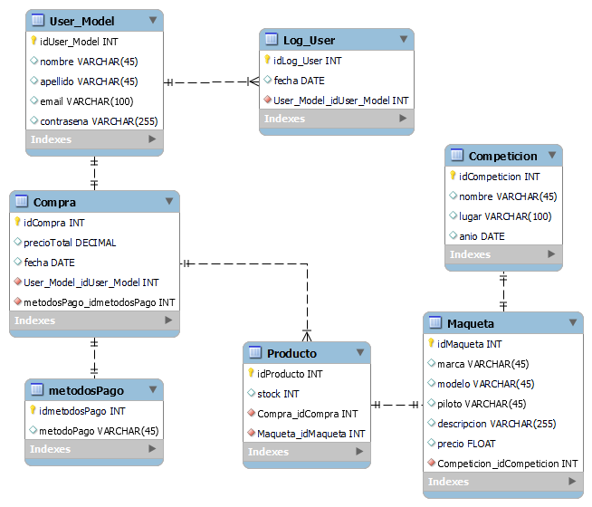
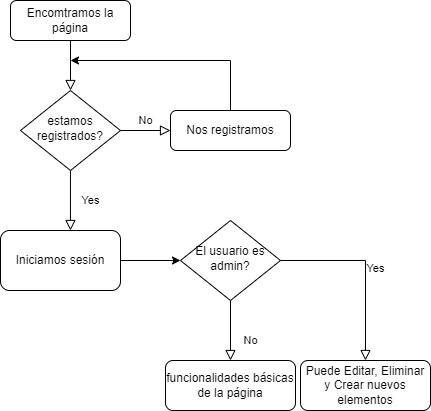

## Diagrama E / R


## Mapa de la página



## Credenciales

```
Crear y vincular tu base de datos en el apartado 
spring.datasource.url=jdbc:mariadb://localhost:3306/prueba
del application propperties.

```

```
Crear en la base de datos importada un usuario de nombre "proyecto" y contraseña "1234"
```

##Inserts

*EJECUTAR ANTES DE HACER LOS INSERTS*

```

INSERT INTO `competicion` (`id_competicion`, `anio`, `lugar`, `mejor_resultado`, `nombre`) VALUES
(1, '2019', 'Montecarlo', NULL, 'Rallye Monte-Carlo'),
(2, '2020', 'Japón', NULL, 'FORUM8 Rally Japan'),
(3, '2016', 'Finlandia', NULL, 'Rally de los Mil Lagos');


INSERT INTO `compra` (`id_compra`, `fecha`, `fk_id_metodos_pago`, `fk_id_usuario`, `precio_total`, `propietario_id`, `metodo_pago_id_metodos_pago`, `usuario_id`) VALUES
(1, NULL, 0, 0, NULL, NULL, NULL),
(2, NULL, 0, 0, NULL, NULL, NULL),
(3, NULL, 0, 0, NULL, NULL, NULL),
(4, NULL, 0, 0, NULL, NULL, NULL),
(5, NULL, 0, 0, NULL, NULL, NULL),
(6, NULL, 0, 0, NULL, NULL, NULL),
(7, NULL, 0, 0, NULL, NULL, NULL),
(8, NULL, 0, 0, NULL, NULL, NULL),
(9, NULL, 0, 0, NULL, NULL, NULL),
(10, NULL, 0, 0, NULL, NULL, NULL),
(11, NULL, 0, 0, NULL, NULL, NULL),
(12, NULL, 0, 0, NULL, NULL, NULL),
(13, NULL, 0, 0, NULL, NULL, NULL),
(14, NULL, 0, 0, NULL, NULL, NULL),
(15, NULL, 0, 0, NULL, NULL, NULL);


INSERT INTO `maqueta` (`id_maqueta`, `descripcion`, `fk_id_competicion`, `precio`, `competicion_id_competicion`, `compra_id_compra`, `image`, `marca`, `modelo`, `piloto`) VALUES
(13, 'Ha disputado 133 pruebas en el campeonato del mundo, y ha logrado tres victorias —en el Rally de Alemania de 2013 y en el Rally de Cerdeña 2019 y 2020—​ y 38 podios.​ Es uno de los tres pilotos españoles que ha ganado algún rally en el WRC. ', 2, 13,  2, 14, '/raw/HyundaiI20.jpg', 'Hyundai', 'I20', 'Dani Sordo'),
(14, 'Gus Greensmith fue portero en las inferiores del Manchester City y piloto de karting antes de ser piloto de rallies. Como piloto de karting, hizo su carrera en Mánchester, participó en el Campeonato Mundial de Karting CIK-FIA U18 en 2012.', 3, 17,  3, 15, '/raw/fordPuma.jpg', 'Ford', 'Puma', 'Gus Greensmith'),
(21, 'Takamoto Katsuta (Katsuta Takamoto, Japón, 17 de marzo de 1993) es un piloto de rally japonés. Actualmente compite para el Tommi Mäkinen Racing en el campeonato de WRC-2 con un Ford Fiesta R5. Además es piloto de desarrollo del Toyota Gazoo Racing WRT.', 2, 16.99,  2, 15, '/raw/ToyotaYarisWRC.jpg', 'Toyota', 'Yaris WRC', 'Takamoto Katsuta'),
(24, 'El escándaloso porsche del ex-portero del Val', 1, 16.22, 1, NULL, 'shopping.png', 'Porsche', 'Carrera', 'Cañizares'),
(25, 'Uwu Rally', 0, 16.22, 2, NULL, NULL, 'Porsche', 'dadad', 'Cañizares');


tabla metodos_pago(no se usa):
INSERT INTO `metodos_pago` (`id_metodos_pago`, `metodo_pago`) VALUES
(1, 'Tarjeta'),
(2, 'Pay Pal');


```

## Uso

### Alta

```
En el inicio de la página nos da a elegir entre Registro e Iniciar Sesión, en un principio seleccionaremos
"Registro" y nos crearemos una cuenta propia, una vez que el registro se ha realizado correctamente se nos redirigirá
directamente a la página de login, en dicha página procederemos a iniciar sesión con el usuario registrado en este caso
la clave para iniciar sesión es el email que hayamos introducido al crear nuestro usuario
```

### Página principal

```
Una vez en la página principal veremos como tenemos la capacidad de editar, eliminar y crear Maquetas. Asimismo 
también tenemos la capacidad de ver los detalles de una maqueta seleccionada, y añadirla al carrito de la compra.
En futuras implementaciones se separará la parte de usuario con la de la gestión de los productos.
```

### Detalle

```
En el apartado de ver los detalles se nos expondrá la maqueta en grande con todos los datos que contiene, desde
el detalle también hay implementado un botón desde el cuál podemos añadir al carrito la maqueta que estamos viendo 
en detalle. 
```

### Carrito

``` 
Por lo que respecta al carrito se nos irán añadiendo las maquetas que seleccionemos, y se sumarán automáticamente
los precios de las maquetas para saber cuál será el precio final de la compra. En todo momento dispondremos de un 
botón para eliminar cualquiera de las maquetas que tenemos en el carrito. Finalmente nos queda el botón de procesar
compra, el cuál nos mostrará una pequeña factura de la compra la cuál podremos descargar tanto en PDF como en XLSX.
Una vez procesada la compra se eliminan los ítems del carrito. 
```
